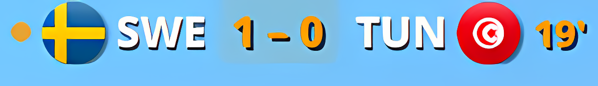

# Football Live — KDE Plasma 6 widget

Live football scores in your system tray, with match details, line-ups, group
tables, knockout brackets and optional AI commentary.



## Features

- **Glanceable tray widget** — current score, teams and match clock, with a
  blinking live indicator during play.
- **Full popup** — live & finished matches, kickoff times, goalscorers, group
  standings, knockout brackets, and a detailed match card with line-ups and
  player ratings.
- **Sharp rendering** on 4K / fractional-scaled displays; crisp text with
  optional outline and drop shadow (configurable per style group).
- **Optional AI live commentary** — British-TV-style lines on goals, cards and
  the run of play, optionally read aloud in a British voice. Run it **locally**
  on your own GPU (via [Ollama](https://ollama.com)), or use a **free cloud
  provider** (OpenRouter, Groq, Gemini, OpenCode Zen) if you have no GPU — set
  up with a single paste of a free API key. In local mode, no data leaves your
  machine.

## Install

### From the KDE Store
Right-click your panel → **Add Widgets → Get New Widgets → Download New
Plasma Widgets**, then search for **Football Live**.

### Manual
```sh
git clone https://github.com/GaimsDevSoftware/fotballtray.git
kpackagetool6 --type Plasma/Applet --install fotballtray
```
Then add the **Football Live** widget to your panel / system tray.

## Optional backend (live data + AI commentary)

The widget reads match data from a small local data service and an optional
commentary generator. See the in-app **Settings → Live commentary (AI)** panel
to enable local (Ollama) or free cloud commentary.

## License

[MIT](LICENSE) © 2026 GaimsDevSoftware
